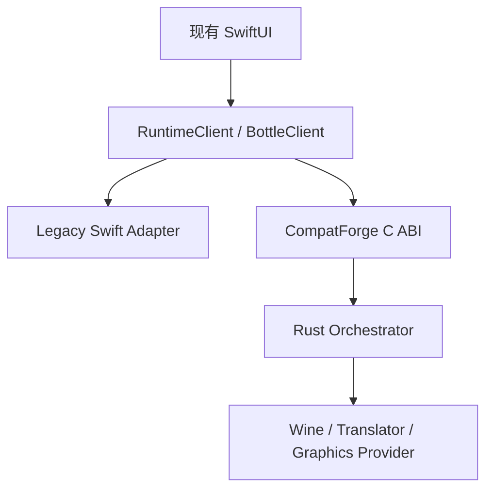

# Mac-Win → CompatForge 迁移计划

迁移基线为 `a1112/Mac-Win@4282ed9e3d743219d5b35b8bda47ac29a7c663d5`。详细证据与文件规模记录在 [源工程审计基线](docs/migration/source-baseline.md)。

## 核心判断

Mac-Win 已拥有大量产品资产，但这些资产与 macOS 执行细节耦合：

- `WineRunner.swift` 同时承担 Wine Provider、Rosetta Translator、进程管理、环境合并、兼容修复、日志和终止流程。
- `EngineRegistry.swift` 保存开发机绝对路径，并把具体 Runtime 布局当作领域模型。
- `ApplicationCompatibilityProfile.swift` 把约 40 类应用特例编译进 Swift enum。
- `BottleService.swift` 混合 Bottle 生命周期、Windows 注册表修复、字体、网络和应用发现。
- `MacWinStore.swift` 与 `ContentView.swift` 分别成为超大型 Service Locator/ViewModel 与 UI 集合。

因此迁移对象不是“Swift 文件”，而是三个不同层次：

1. **保留并数据化**：Recipe、软件样本、签名目录、诊断分类、冒烟测试、修复审计、支持包。
2. **通过适配器过渡**：现有 SwiftUI、Bottle 目录、macOS 原生窗口与输入集成。
3. **重新实现**：运行编排、Provider 选择、Runtime Pack、CPU/图形能力协商、进程监督、跨平台路径和安全边界。

## Strangler 迁移法

每迁移一个 use case，先在新旧后端执行同一份契约测试，再把默认路由切到 Rust，最后删除对应 Swift 执行逻辑。迁移期间不得让新核心读取 Swift 私有对象；跨边界只传版本化数据或稳定句柄。

## 文件映射

| Mac-Win | CompatForge 目标 | 策略 |
|---|---|---|
| `Models.swift` | `compatforge-domain` + `schemas/` | 重建版本化模型，保留领域概念 |
| `WineRunner.swift` | runtime-wine、translator、process-supervisor、platform-macos | 分解重写 |
| `BottleService.swift` | bottle-manager + typed repair actions | 分阶段迁移，先双读后切写 |
| `EngineRegistry.swift` | runtime-pack-registry | 删除绝对路径，改为 digest 固定与签名清单 |
| `GraphicsPreset.swift` | graphics-policy + backend providers | 从 enum/环境变量生成改为能力协商 |
| `ApplicationCompatibilityProfile.swift` | signed Recipe v2 + compat-db | 先数据化、验证、签名，再移除 enum |
| `CatalogService.swift` | compat-catalog | 保留签名和哈希思想，升级密钥轮换与回滚保护 |
| Smoke/Test/Support 服务 | compat-lab + diagnostics | 优先迁移，是可持续兼容性的核心资产 |
| `MacWinStore.swift` | feature clients/use cases | 拆成 Bottle、Catalog、Runtime、Diagnostics、Settings |
| `ContentView.swift` | feature-based SwiftUI modules | 保留 UI 过渡，按功能拆分 |
| `MacWinPaths.swift` | platform-filesystem | 分别实现 macOS、XDG、Android app storage |
| Wine patches / fixtures | `patches/` + `tests/windows-probes/` | 保留、补元数据、上游状态与自动回归 |

## 数据迁移规则

- 所有旧 Bottle 首次导入前创建只读备份与内容清单。
- `engineId` 迁移为 `{runtimePack.id, runtimePack.digest}`，不得只存浮动版本。
- Recipe v1 → v2 必须是纯转换：不下载文件、不启动 Wine、不改注册表。
- 兼容修复从隐式代码分支转为带 `risk`、`precondition`、`rollback` 和测试的 typed action。
- 迁移完成前保持旧 manifest 可读；新版本写入使用独立 schemaVersion 和原子替换。
- 任意迁移失败都回滚到上一次完整快照，并保留脱敏日志。

## 合并与删除门槛

旧代码只有同时满足以下条件才能删除：

1. 新接口已在 macOS x86_64/ARM64 目标机器验证；
2. golden contract tests 证明新旧输入输出等价，或差异已通过 ADR 接受；
3. 代表应用矩阵没有 P0/P1 回归；
4. Bottle 迁移可恢复，Runtime Pack 可回滚；
5. 诊断和支持包能解释新路径的选择与失败；
6. 发行物不含开发机绝对路径、未固定下载或未记录许可证组件。

阶段、任务编号、人员建议和退出标准见 [迁移工作分解](docs/migration/work-breakdown.md)。
