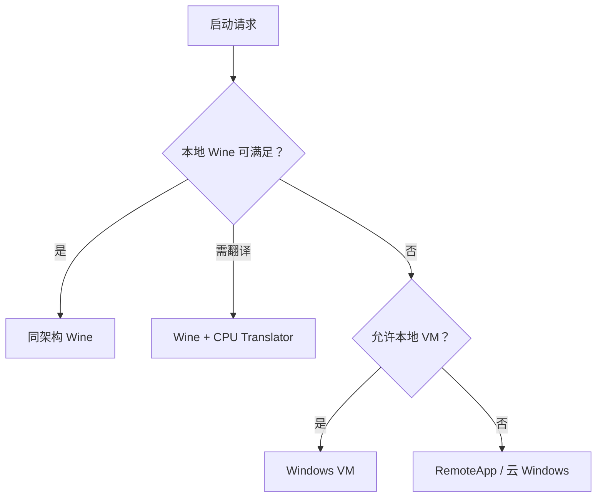

# CompatForge

CompatForge 是从 [Mac-Win](https://github.com/a1112/Mac-Win) 演进而来的跨平台 Windows 应用兼容运行控制平面。它不重写 Wine，而是统一编排 Wine、CPU 二进制翻译、图形转换、虚拟机和远程 Windows，并用签名运行包、兼容配方与可重复测试交付“可验证的兼容性”。

> 当前状态：Core/API `0.12.0`，ABI major `1`。Rust Core 统一负责受限 macOS Wine 自动发现、Preview Pack 登记、GUI/Console PE inspection、`bottleInPlace` 路径/哈希复验、摘要绑定的 CJK 字体准备，以及持久化 Application/Bottle/Settings/Job 服务。C ABI 新增 `cf_service_create/cf_service_call/cf_service_release`，CLI 提供单次 `api` 与常驻 JSON Lines `api-session`。`apps/desktop` 是只消费同一 Service API 的 Tauri 2 薄壳：主窗口专注应用启动与管理，设置使用独立的 macOS 风格窗口。默认 CI 不下载或运行真实 Windows GUI 应用；真实窗口、应用行为和清理证据不扩大为通用兼容结论。

> 工程方向：`CompatForge` 是唯一主工程；桌面 UI 使用 Tauri 2 + TypeScript，当前里程碑优先 macOS ARM64，同时保留 Rust Core 的跨平台能力。`Mac-Win` 暂停维护，仅作为迁移知识与测试资产来源。

## 目标

- 将 Mac-Win 中有价值的 Bottle、应用目录、兼容规则、诊断、冒烟矩阵和支持包能力迁移为平台无关资产。
- 把运行决策从 Swift/macOS 代码中分离，形成 Rust 控制面与稳定 C ABI。
- 支持本地 Wine、Wine + CPU 翻译、Windows VM、远程 Windows 四级回退。
- 让每一次启动都能追溯到精确 Runtime Pack、Recipe、能力探测结果和决策过程。
- 共享内核同步支持 macOS 与 Linux，再扩展 Linux ARM64 与 Android ARM64。

## 明确不做

- 不从零实现 Win32/Win64 API，也不复制 Wine。
- 不把 Bottle 当作强安全沙箱。
- 不把 Rosetta、GPTK/D3DMetal 或任何单一厂商组件写死到核心模型。
- 不直接执行 AI 生成的修复，也不从未知来源下载 DLL。
- 不进行一次性 5 万行 Swift 全量重写。

## 运行路径



选择顺序是策略默认值，不是硬编码结论。Recipe、企业策略、硬件能力和已认证测试结果均可限制候选 Provider。

## 平台优先级

| 主机 | 应用架构 | 首选路径 | 目标等级 |
|---|---|---|---|
| macOS ARM64 | x86 / x86_64 | Wine + 可替换翻译器；VM/远程兜底 | Tier 1，Phase 1 |
| Linux x86_64 | x86 / x86_64 | Wine / Proton 组件 + DXVK/vkd3d-proton | Tier 1，Phase 2 |
| Linux ARM64 | x86 / x86_64 | FEX + Wine；Box64/QEMU 兜底 | Tier 2，Phase 3 |
| Android ARM64 | x86 / x86_64 | Wine + 翻译器 + Vulkan；远程兜底 | Preview，Phase 4 |
| Windows | — | 开发、Schema、核心逻辑与工具链验证 | 开发主机 |

完整边界见 [平台支持矩阵](docs/platform-support.md)。

## 仓库结构

```text
apps/                         CLI 与 Tauri/Vite 桌面薄前端
crates/                       领域模型、存储、编排、进程监督与 C ABI
schemas/                      稳定的跨进程/跨语言数据契约
examples/                     契约示例，不是可发布 Runtime
docs/architecture/            架构和 Provider 接口
docs/decisions/               已接受的架构决策记录
docs/migration/               Mac-Win 审计基线与工作分解
scripts/                      不依赖第三方包的仓库验证工具
```

## 本地验证

需要 Rust stable 与 Python 3.11+：

```bash
python scripts/validate_repository.py
cargo fmt --all --check
cargo test --workspace
cargo clippy --workspace --all-targets -- -D warnings
cargo run -p compatforge-cli -- probe
cargo run -p compatforge-cli -- inspect tests/fixtures/hello-x86_64.exe
cargo run -p compatforge-cli -- demo-plan
cargo run -p compatforge-cli -- provider macos probe <provider-config.json>
cargo run -p compatforge-cli -- provider macos context <provider-config.json> <storage-root>
cargo run -p compatforge-cli -- local macos context <bootstrap-request.json>
cargo run -p compatforge-cli -- prepared-plan <context-config.json> <absolute-console-pe> <launch-request.json>
cargo run -p compatforge-cli -- prepared-launch <context-config.json> <absolute-console-pe> <launch-request.json>
cargo run -p compatforge-cli -- runtime manifest-digest \
  examples/runtime-packs/wine-linux-arm64-fex.json
```

首次构建会下载 `serde`、`serde_json` 与 RustCrypto `sha2` 及其传递依赖。前两者用于版本化契约和 JSON 边界，`sha2` 同时用于 Runtime Pack 与 macOS Provider 入口点的流式内容校验；JSON 依赖依据见 [ADR-0005](docs/decisions/0005-serde-for-versioned-contracts.md)，Runtime digest 边界见 [ADR-0008](docs/decisions/0008-runtime-pack-content-store.md)。

生成可复现 LaunchPlan：

```bash
cargo run -p compatforge-cli -- plan \
  examples/context-config.linux-arm64.json \
  examples/launch-request.json
```

C/C++ 客户端可使用 `cf_probe_capabilities`、`cf_inspect_executable`、`cf_macos_local_context_create`、Context/plan/process API，以及 `cf_launch_prepare`、PreparedLaunch getter/start/release。Tauri 桌面壳在同一进程内直接调用这些 Rust Core 类型，不重新实现发现或启动策略。`ExecutableRequest.mode` 默认为 `immutableArtifact`；安装后需要保留 Bottle 内相邻 DLL/资源时使用 `bottleInPlace`，Core 会在 spawn 前再次检查 `<storageRoot>/bottles/<bottleId>/prefix/drive_c` 内的普通文件和 SHA-256。Bottle 不是安全沙箱。外部调用方必须先检查 API 版本再解析 additive symbol。

构建 Tauri 桌面壳（Node.js 24、Rust stable、Tauri 2）：

```bash
npm ci --prefix apps/desktop
npm run build --prefix apps/desktop
cargo test --manifest-path apps/desktop/src-tauri/Cargo.toml --locked
npm run tauri --prefix apps/desktop -- build --bundles app
COMPATFORGE_DESKTOP_SMOKE=1 \
  apps/desktop/src-tauri/target/release/bundle/macos/CompatForge.app/Contents/MacOS/CompatForge
```

三个 GUI 基线的下载与验收必须使用仓库外目录；下载命令默认拒绝网络：

```bash
python tools/download_gui_assets.py list --cache-root /absolute/external/cache
python tools/run_gui_baseline.py \
  --compatforge-cli /absolute/path/to/compatforge-cli \
  --cache-root /absolute/external/cache \
  --runtime-store /absolute/external/runtime-store \
  --storage-root /absolute/external/storage \
  --work-root /absolute/external/gui-evidence \
  --allow-network
```

默认运行只生成 `unverified` 证据。只有完成逐应用人工行为检查后，才可追加
`--accept-interactive --interaction-evidence /absolute/external/interactions.json`；该 JSON 的固定字段见
`docs/implementation/phase-2-tauri-gui-baseline.md`。验收结果逐应用标记为 `accepted`、`failed` 或
`unverified`；截图和 RuntimeEvent 证据不会进入 Git，也不由默认 CI 生成。

人工验收先生成 fail-safe 工作表；所有检查默认是 `false`，观察者必须填写带时区的 `observedAt`
并逐项确认后才能用于 `accepted`：

```bash
python tools/prepare_gui_interaction_evidence.py \
  --output /absolute/external/interactions.json \
  --observer "Compatibility Lab" \
  --app 7zip
python tools/summarize_gui_compatibility.py \
  --input /absolute/external/gui-evidence/summary.json \
  --output /absolute/external/gui-evidence/release-gate.json
```

默认只运行三个基线应用。显式认证矩阵共十项：Firefox/Gecko、Krita/Qt/OpenGL、7-Zip x86、VLC、WinMerge、Audacity x86 和 Everything x86 均须通过重复 `--app` 选择，不会静默进入默认发布门禁。

扩展矩阵的生命周期 soak 使用逐轮新 Bottle，并把可恢复的 `cycles.jsonl` 和汇总写到仓库外。默认运行五个认证扩展应用和 60 轮；该门禁只证明窗口、截图、退出与零残留，不能替代人工功能验收：

```bash
python3 -S -B tools/run_gui_soak.py \
  --compatforge-cli /absolute/path/to/compatforge-cli \
  --cache-root /absolute/external/cache \
  --output-root /absolute/external/soak-60 \
  --cycles 60
```

## 设计入口

- [总体架构](docs/architecture/overview.md)
- [组件与所有权](docs/architecture/component-model.md)
- [Provider、IPC 与 C ABI 契约](docs/architecture/contracts.md)
- [Phase 0 纵向切片](docs/implementation/phase-0-vertical-slice.md)
- [受控进程纵向切片](docs/implementation/phase-0-process-supervisor.md)
- [Host Capability 纵向切片](docs/implementation/phase-1-host-capability.md)
- [Runtime Pack 存储纵向切片](docs/implementation/phase-1-runtime-pack.md)
- [macOS Provider 纵向切片](docs/implementation/phase-1-macos-provider.md)
- [PE inspection 纵向切片](docs/implementation/phase-1-pe-inspection.md)
- [Trusted Launch Preparation 纵向切片](docs/implementation/phase-1-trusted-launch-preparation.md)
- [Tauri 桌面壳与 GUI 基线](docs/implementation/phase-2-tauri-gui-baseline.md)
- [Phase 2.1 交互式兼容认证](docs/implementation/phase-2-1-interactive-certification.md)
- [Apple Silicon 本地无头预览指南](docs/guides/macos-headless-preview.md)
- [进程树与 Wine 生命周期决策](docs/decisions/0006-process-tree-and-wine-lifecycle.md)
- [能力证据与 Provider 声明决策](docs/decisions/0007-capability-evidence-boundary.md)
- [Runtime Pack 内容寻址与原子激活决策](docs/decisions/0008-runtime-pack-content-store.md)
- [macOS Provider 证据决策](docs/decisions/0009-macos-provider-evidence.md)
- [Inspection-bound Guest Artifact 决策](docs/decisions/0011-inspection-bound-guest-artifacts.md)
- [Tauri 桌面壳决策](docs/decisions/0012-tauri-desktop-shell.md)
- [Mac-Win 迁移总计划](MIGRATION.md)
- [迁移工作分解与退出标准](docs/migration/work-breakdown.md)
- [Mac-Win portable asset 迁移边界与离线结果](docs/migration/macwin-portable-assets.md)
- [Mac-Win patch 来源、许可证与隔离证据](docs/migration/macwin-patch-provenance.md)
- [安全模型](docs/security.md)
- [测试策略](docs/testing.md)

## 许可证状态

项目自身的开源许可证尚未由仓库所有者确定，因此本仓库暂不声明一个猜测性的根许可证。引入或分发 Wine、DXVK、vkd3d-proton、FEX、Box64、QEMU、MoltenVK 等组件前，必须完成 [第三方合规门禁](docs/compliance.md)，生成 SBOM/NOTICE，并履行各组件许可证义务。
