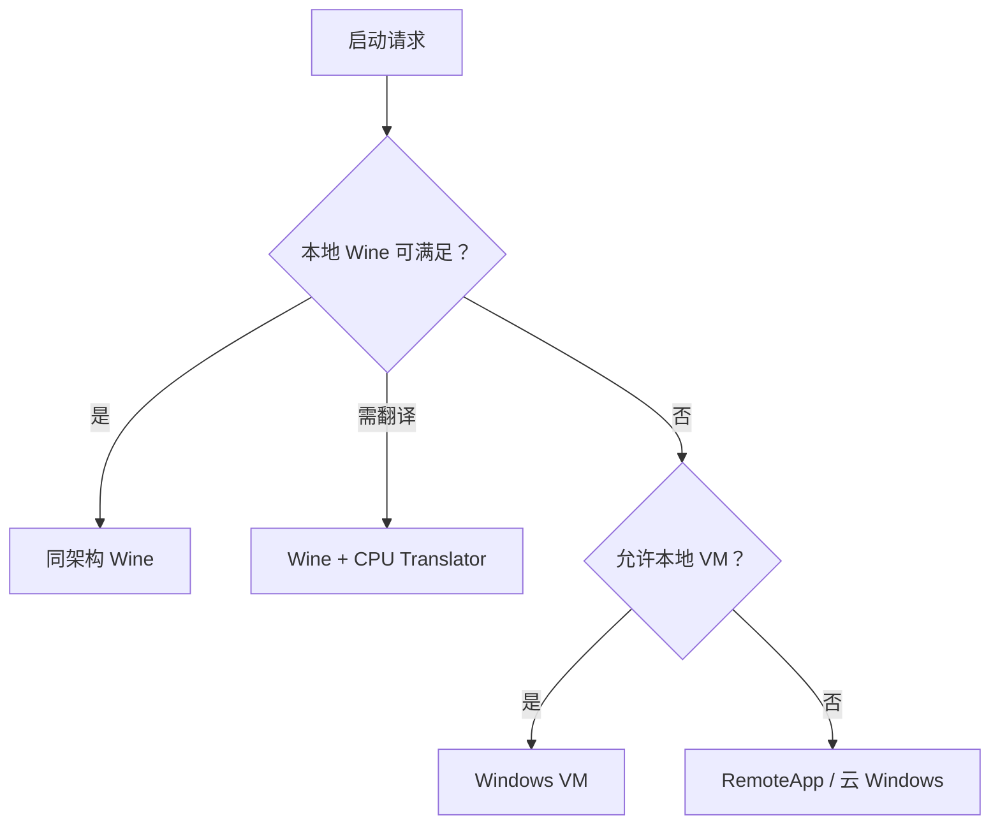

# CompatForge

CompatForge 是从 [Mac-Win](https://github.com/a1112/Mac-Win) 演进而来的跨平台 Windows 应用兼容运行控制平面。它不重写 Wine，而是统一编排 Wine、CPU 二进制翻译、图形转换、虚拟机和远程 Windows，并用签名运行包、兼容配方与可重复测试交付“可验证的兼容性”。

> 当前状态：Phase 0 首个纵向切片。Core 已能读取版本化 Context/LaunchRequest JSON，经约束校验生成完整 LaunchPlan JSON，并通过稳定 C ABI 或 CLI 返回；尚不启动进程，也不包含可分发的 Wine Runtime。

## 目标

- 将 Mac-Win 中有价值的 Bottle、应用目录、兼容规则、诊断、冒烟矩阵和支持包能力迁移为平台无关资产。
- 把运行决策从 Swift/macOS 代码中分离，形成 Rust 控制面与稳定 C ABI。
- 支持本地 Wine、Wine + CPU 翻译、Windows VM、远程 Windows 四级回退。
- 让每一次启动都能追溯到精确 Runtime Pack、Recipe、能力探测结果和决策过程。
- 先稳定 macOS，再交付 Linux x86_64、Linux ARM64，最后进入 Android ARM64。

## 明确不做

- 不从零实现 Win32/Win64 API，也不复制 Wine。
- 不把 Bottle 当作强安全沙箱。
- 不把 Rosetta、GPTK/D3DMetal 或任何单一厂商组件写死到核心模型。
- 不直接执行 AI 生成的修复，也不从未知来源下载 DLL。
- 不进行一次性 5 万行 Swift 全量重写。

## 运行路径



选择顺序是策略默认值，不是硬编码结论。Recipe、企业策略、硬件能力和已认证测试结果均可限制候选 Provider。

## 平台优先级

| 主机 | 应用架构 | 首选路径 | 目标等级 |
|---|---|---|---|
| macOS ARM64 | x86 / x86_64 | Wine + 可替换翻译器；VM/远程兜底 | Tier 1，Phase 1 |
| Linux x86_64 | x86 / x86_64 | Wine / Proton 组件 + DXVK/vkd3d-proton | Tier 1，Phase 2 |
| Linux ARM64 | x86 / x86_64 | FEX + Wine；Box64/QEMU 兜底 | Tier 2，Phase 3 |
| Android ARM64 | x86 / x86_64 | Wine + 翻译器 + Vulkan；远程兜底 | Preview，Phase 4 |
| Windows | — | 开发、Schema、核心逻辑与工具链验证 | 开发主机 |

完整边界见 [平台支持矩阵](docs/platform-support.md)。

## 仓库结构

```text
apps/                         CLI 与未来平台前端
crates/                       版本化领域模型、存储、编排与 C ABI
schemas/                      稳定的跨进程/跨语言数据契约
examples/                     契约示例，不是可发布 Runtime
docs/architecture/            架构和 Provider 接口
docs/decisions/               已接受的架构决策记录
docs/migration/               Mac-Win 审计基线与工作分解
scripts/                      不依赖第三方包的仓库验证工具
```

## 本地验证

需要 Rust stable 与 Python 3.11+：

```bash
python scripts/validate_repository.py
cargo fmt --all --check
cargo test --workspace
cargo clippy --workspace --all-targets -- -D warnings
cargo run -p compatforge-cli -- demo-plan
```

首次构建会下载 `serde` 与 `serde_json`。它们只用于版本化契约和 JSON 边界；引入依据见 [ADR-0005](docs/decisions/0005-serde-for-versioned-contracts.md)。

生成可复现 LaunchPlan：

```bash
cargo run -p compatforge-cli -- plan \
  examples/context-config.linux-arm64.json \
  examples/launch-request.json
```

Swift/C 客户端当前可使用 `cf_context_create`、`cf_compile_launch`、`cf_last_error_json`、`cf_string_free` 与 `cf_context_release`。调用方不需要了解 Rust 对象布局。

## 设计入口

- [总体架构](docs/architecture/overview.md)
- [组件与所有权](docs/architecture/component-model.md)
- [Provider、IPC 与 C ABI 契约](docs/architecture/contracts.md)
- [Phase 0 纵向切片](docs/implementation/phase-0-vertical-slice.md)
- [Mac-Win 迁移总计划](MIGRATION.md)
- [迁移工作分解与退出标准](docs/migration/work-breakdown.md)
- [安全模型](docs/security.md)
- [测试策略](docs/testing.md)

## 许可证状态

项目自身的开源许可证尚未由仓库所有者确定，因此本仓库暂不声明一个猜测性的根许可证。引入或分发 Wine、DXVK、vkd3d-proton、FEX、Box64、QEMU、MoltenVK 等组件前，必须完成 [第三方合规门禁](docs/compliance.md)，生成 SBOM/NOTICE，并履行各组件许可证义务。
