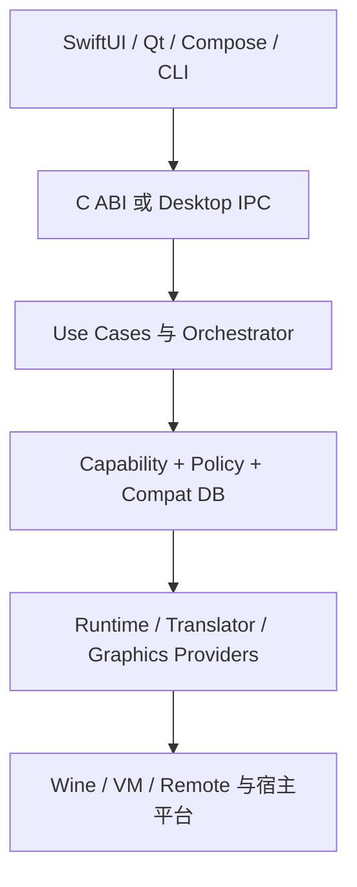
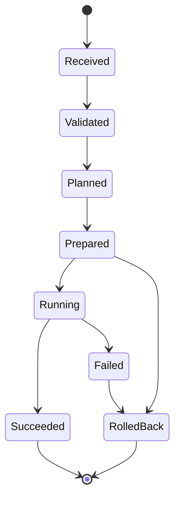

# 总体架构

## 产品边界

CompatForge 是兼容运行“控制平面”，不是新的 Windows API 实现。它负责发现主机能力、验证可信资产、选择运行路径、编译 LaunchPlan、监督进程、收集结构化事件并把结果写入兼容知识库。Wine、FEX、Box64、QEMU、DXVK 等保持各自原生语言与构建系统，通过 Provider 边界集成。

## 分层

| 层 | 责任 | 禁止事项 |
|---|---|---|
| Frontend | 呈现、用户意图、权限确认 | 拼装 Wine 环境变量或 Runtime 路径 |
| API/IPC | 版本协商、句柄、事件流、取消 | 暴露 Rust 内存布局或 Swift 类型 |
| Use Cases | Bottle、安装、启动、诊断、测试工作流 | 依赖特定 GUI 生命周期 |
| Orchestrator | 能力约束、候选评分、回退、LaunchPlan | 直接下载或启动未验证组件 |
| Knowledge | Recipe、认证结果、已知问题、策略 | 无签名远程更新、隐式代码执行 |
| Providers | Probe、Prepare、Compile、Launch/Terminate | 自行改变全局选择顺序 |
| Platform | 文件、进程、沙箱、显示、输入、设备 | 把平台 API 泄漏到领域模型 |

## 控制面与数据面

控制面包含 Rust Core、Recipe/Runtime Registry、能力探测与策略；数据面是实际 Wine/VM/Remote 进程、GPU 转换器、文件挂载和网络。二者必须可分别升级：UI 或 Core 更新不应隐式替换一个 Bottle 已固定的 Runtime Pack。

桌面端最终采用守护进程持有长期运行任务，UI 通过 Unix domain socket/Named Pipe 连接；移动端首版允许核心进程内运行，避免 Android 后台生命周期复杂度。无论传输方式如何，消息都使用同一版本化 schema。

## 启动状态机

关键原则：`Planned` 之前不得产生外部副作用；`LaunchPlan` 必须完整列出 Runtime digest、Translator、Graphics backend、argv、environment、mounts、sandbox 和 decision trace。

## Provider 选择

选择分三步，不把所有条件堆入一个巨大 enum：

1. **硬约束过滤**：主机/应用架构、OS、GPU API、驱动需求、Runtime 版本、企业策略、签名状态。
2. **已认证优先**：优先使用在相同 Recipe + Runtime digest + 设备族上通过 smoke 的组合。
3. **成本评分与回退**：本地同架构 Wine → Wine + 翻译 → VM → Remote；用户和管理员可禁用后两级。

Provider 的“available”不等于“suitable”。例如系统存在 Vulkan 并不证明 vkd3d-proton 所需扩展完整，存在 Rosetta 也不代表它是长期可依赖路线。

## 持久化边界

- **签名 JSON**：Recipe、Runtime Pack manifest、公开目录、策略包。
- **SQLite**：本地索引、运行历史、诊断事件、兼容结果、任务状态。
- **内容寻址存储**：Runtime 组件、下载资产、测试产物，以 SHA-256 digest 定位。
- **Bottle 文件树**：Windows prefix 与用户数据，使用事务锁、快照和显式 layoutVersion。

JSON 是交换格式，不承担高并发事务。SQLite 是索引和状态库，不直接存大型 Runtime 二进制。

## 架构不变量

1. Core 不包含 `/usr/bin/arch`、XDG 路径、Android SAF 或 GPTK 目录常量。
2. Runtime、Translator、Graphics 是三个独立选择维度。
3. 每个外部二进制都可追溯到来源、版本、许可证、digest 与 SBOM。
4. Recipe action 必须 typed、可审核、有限权限，并定义回滚。
5. 所有启动参数按 argv 传递，禁止 shell 插值。
6. 支持包默认脱敏，并允许用户在上传前预览。
7. 兼容认证绑定精确矩阵；“在某台机器上运行过”不能升级为全局兼容结论。
