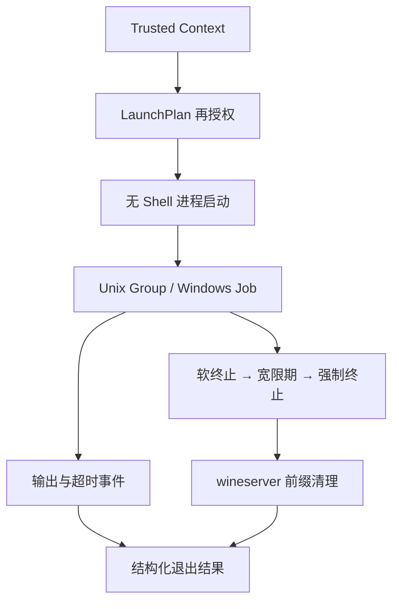

# Phase 0 受控进程纵向切片

版本 `0.4.0` 将受监督执行推进到跨平台进程树与 Wine prefix 生命周期闭环：

## 已实现

- `compatforge-process` 使用 `executable + argv[]` 直接启动，不拼接 shell 命令；
- 启动前把序列化 LaunchPlan 与当前 `CoreConfig` 再次比对，拒绝被替换的 Runtime digest、入口、受保护环境、沙箱档位、工作目录和 Wine prefix；
- 子进程环境从空集合建立，只注入 LaunchPlan 明确列出的值；
- stdout/stderr 以有序 `RuntimeEvent` 传输；直接子进程退出后拒绝迟到输出，避免继承管道的后代进程阻塞退出观察；
- Unix 在 `exec` 前调用 `setpgid(0, 0)`，终止信号作用于整组；Windows 把启动进程和后代绑定到带 `KILL_ON_JOB_CLOSE` 的 Job Object；
- `SupervisorPolicy` 由受信任 Context 固定，并在执行前重新授权；支持最大运行时限、软终止宽限期和强制终止升级；
- `RuntimeEvent` 记录 `timed-out`、`grace-period-expired` 与 `wine-server-stop-requested`，终止仍保持幂等；
- 显式固定 `wineserverExecutable` 的 Wine Runtime 使用 prefix 排他租约，结束时以相同环境执行 `wineserver -k` 与 `-w`；同一 Core 进程内拒绝同 prefix 并发受管启动；
- 根进程退出后仍强制清理残留 process group/Job Object 后代，释放 handle 也不会遗留进程树；
- CLI 新增 `launch`，C ABI 新增 start/events/terminate/release。

## 当前边界

当前 Wine prefix 租约仅覆盖单个 Core 进程；进入多进程 Desktop daemon 前需改为守护进程权威租约或文件锁。Windows 的 `CTRL_BREAK` 是尽力而为，可靠兜底由 Job Object 强制终止提供。真正的 macOS seatbelt、Linux namespace/seccomp/Landlock、资源配额、Runtime Pack 安装与签名仍未实现。

Qt/QML 前端只消费 C ABI/IPC 和版本化事件，不拥有 Child PID，也不能绕过 LaunchPlan 再授权直接执行宿主命令。
