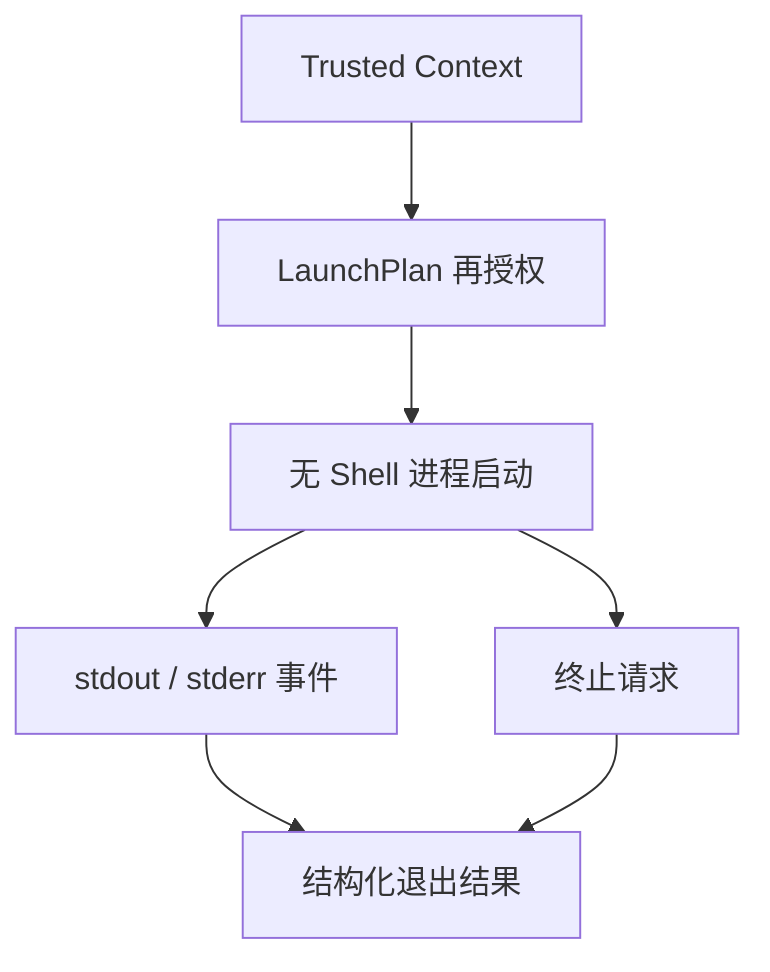

# Phase 0 受控进程纵向切片

版本 `0.3.0` 将无副作用的 LaunchPlan 编译推进到首个受监督执行闭环：

## 已实现

- `compatforge-process` 使用 `executable + argv[]` 直接启动，不拼接 shell 命令；
- 启动前把序列化 LaunchPlan 与当前 `CoreConfig` 再次比对，拒绝被替换的 Runtime digest、入口、受保护环境、沙箱档位、工作目录和 Wine prefix；
- 子进程环境从空集合建立，只注入 LaunchPlan 明确列出的值；
- stdout/stderr 以有序 `RuntimeEvent` 传输；直接子进程退出后立即发出终态事件，并拒绝迟到输出，避免继承管道的后代进程阻塞退出观察；
- `LaunchHandle` 支持轮询、超时、幂等终止和释放时清理；
- CLI 新增 `launch`，C ABI 新增 start/events/terminate/release。

## 当前边界

该切片监督直接子进程，尚未建立 Unix process group、Windows Job Object、优雅终止升级、wineserver 范围清理或真正的 OS 沙箱。Runtime Pack 也仍未下载或安装。因此它适合受控 helper 与后续 Wine Provider 联调，不代表已完成生产级 Wine 生命周期管理。

Qt/QML 前端只消费 C ABI/IPC 和版本化事件，不拥有 Child PID，也不能绕过 LaunchPlan 再授权直接执行宿主命令。
