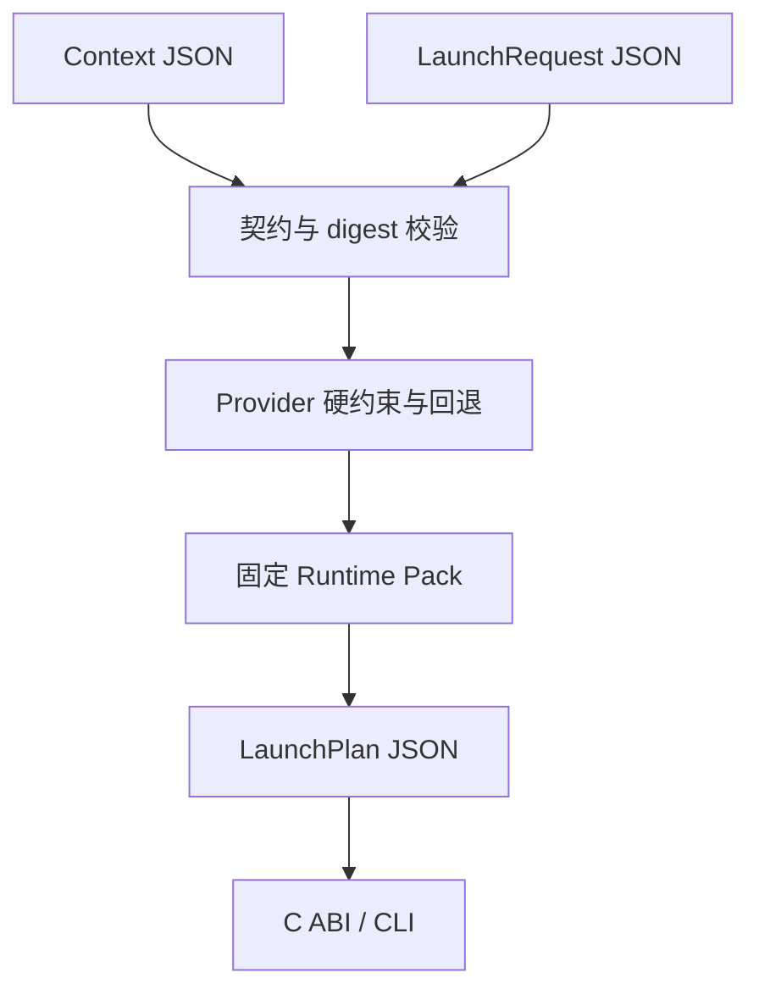

# Phase 0 首个纵向切片

版本 `0.2.0` 打通无副作用计划编译链：

## 输入

- `CoreConfig`：Host 能力快照、可用 Provider、Provider 到 Runtime Pack 的固定绑定、存储根目录与默认沙箱档位；
- `LaunchRequest`：请求 ID、Bottle、Windows 可执行文件、参数、环境和 VM/Remote/网络等约束。

Provider 可用但没有 `packDigest` 绑定时，计划失败；不会退回到浮动的 `latest`。Runtime executable 和 storage root 必须是绝对宿主路径。命令始终使用 `executable + arguments[] + environment{}` 表达，不生成 shell 字符串。

## 输出与所有权

`cf_compile_launch` 返回符合 `launch-plan.schema.json` 的调用方持有字符串。调用方必须使用 `cf_string_free` 释放；Context 使用 `cf_context_release`。Rust panic 在 ABI 边界被截获并映射为稳定状态码，详细错误可由 `cf_last_error_json` 取得。

## 明确边界

该切片只编译计划：不下载 Runtime、不启动 Wine、不创建 Bottle、不修改注册表。Mac-Win 已在提交 `4e421fbea6f59e73e4f813c1f0a14e8db9e36de7` 建立 Client protocols 与动态 ABI 适配器；下一步是构建 macOS x86_64/ARM64 dylib、执行 Swift ABI smoke，并对照一次 legacy launch 的计划输入。验证通过前实际执行继续由 legacy runner 承担。
