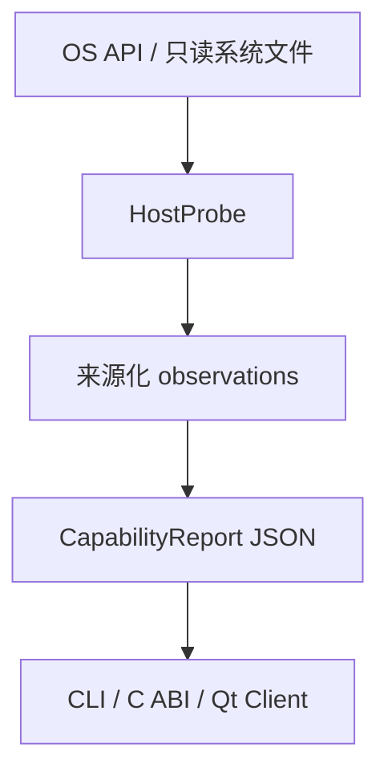

# Phase 1 Host Capability 纵向切片

Core `0.5.0` 建立从本机只读事实到版本化 CapabilityReport 的首个闭环：

## 已实现

- macOS：通过 `sysctl` 与系统版本 plist 读取产品版本、Darwin kernel 和设备型号；
- Linux/Android：读取 `os-release`/build properties、kernel 与可用设备型号文件；
- Windows：通过 `RtlGetVersion` 读取真实系统版本，避免兼容清单导致的版本虚报；
- 所有平台通过 Rust target facts 确认 OS/CPU 架构，并记录逻辑 CPU、指针宽度和字节序；
- 只声明 native translator，其他 Provider 集合保持为空；
- `compatforge-cli probe` 与 `cf_probe_capabilities` 输出相同 JSON；
- Domain 校验 Provider/observation ID 唯一性、状态所需字段和未知架构。

## 当前边界

该切片不执行 GPU 驱动、Vulkan/Metal、Rosetta/FEX、Wine 或图形转换器的主动测试。后续专项 probe 必须固定可执行来源与版本，并把失败原因写入 observations；文件存在和 PATH 命中不能直接产生 `available: true`。
