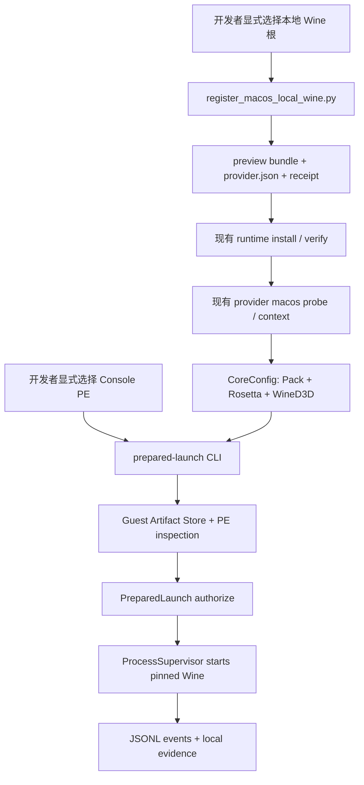

# macOS 无头真实 PE 预览设计

## 状态

- 日期：2026-08-15
- 状态：已批准
- 首个目标：Apple Silicon + Rosetta + 开发者本地 Wine + 真实 x86_64 Windows Console PE
- 实施仓库：CompatForge
- 明确不修改：ForgeOS、ForgeTools、Mac-Win

## 背景

CompatForge Core 0.10.0 已经具备形成真实 macOS 无头运行闭环的大部分基础：

- Runtime Pack manifest、内容对象、active ref、验证和回滚；
- macOS Provider 对固定 Pack、物化根、`wine`、`wineserver`、Mach-O 架构和入口摘要的验证；
- Apple Silicon 上通过实际执行 x86_64 Wine 证明 Rosetta 可用；
- PolicyEngine 将固定 Wine 入口作为宿主进程，将 Windows executable 作为第一个参数；
- Guest Artifact Store 将来宾 PE 固定为内容对象；
- PreparedLaunch 在启动前重新验证 Context、Runtime Binding、Guest Artifact 和完整 LaunchPlan；
- ProcessSupervisor 提供事件、退出、超时、终止升级、prefix 租约和 `wineserver` 清理；
- C ABI 已经公开 `cf_launch_prepare`、`cf_prepared_launch_start` 和对应 getter/release。

当前缺口不是重写上述能力，而是：

1. 没有面向开发者本地 Wine 的受限登记工具；
2. CLI 的 `launch` 仍使用普通 `PolicyEngine::compile`，没有提供 PreparedLaunch 的真实启动入口；
3. 没有 Apple Silicon 上可重复执行的本地真实 Wine + Console PE 验收流程；
4. README 明确指出当前 PreparedLaunch fixture 不执行真实 PE，因此不能把现有 CI smoke 宣称为应用可用性证据。

## 目标

在 Apple Silicon Mac 上，开发者使用自己已经合法安装的 x86_64 Wine，通过显式路径完成以下闭环：

1. 将固定的 `wine` 与 `wineserver` 入口登记为 unsigned preview Runtime Pack 证据；
2. 安装并验证该 Runtime Pack；
3. 由 macOS Provider 实际执行固定 Wine 入口，证明 Pack 与 Rosetta 可用；
4. 生成固定 Runtime/Translator/Graphics 的 CoreConfig；
5. 将开发者明确选择的 x86_64 Console PE 固定到 Guest Artifact Store；
6. 通过 PreparedLaunch 再授权后启动 Wine；
7. 输出结构化事件并观察 Windows probe 的成功标记和零退出码；
8. 在超时、失败或显式终止时清理进程树与 `wineserver`；
9. 保存不进入 Git 的本地验收证据。

## 成功标准

首个里程碑完成时必须同时满足：

- Host 是 macOS ARM64；
- Runtime 是开发者显式指定的 x86_64 Wine；
- Provider 只有在固定 Wine 实际执行成功时才报告 Rosetta available；
- 来宾是 inspection 判定为 `x86_64`、`windowsConsole`、`executable` 的真实 PE；
- 启动使用 `PreparedLaunch::prepare` 和 `PreparedLaunch::authorize`，不使用旧式普通 plan 启动作为验收路径；
- `LaunchPlan.process.executable` 是已验证 Wine 绝对路径；
- `LaunchPlan.process.arguments[0]` 是 Guest Artifact Store 中的固定对象路径；
- Runtime Pack digest、Guest Artifact digest、Context 与计划在启动前重新匹配；
- 事件流包含 started/output/exited，probe 输出固定成功标记，退出成功；
- 重复执行使用相同输入时，Pack 与 Guest Artifact digest 不漂移；
- 失败不会修改来源 Wine 根、来源 PE、相邻仓库或开发者未选择的目录；
- CompatForge、ForgeOS 现有 ABI/API 和测试保持兼容。

## 非目标

本里程碑明确不包括：

- GUI PE、安装器、窗口管理、字体、IME、剪贴板或文件关联；
- Qt 6/QML 桌面客户端；
- D3DMetal、DXVK、MoltenVK 或真实 GPU/driver 认证；
- Wine 下载、发现、自动更新或系统 `PATH` 扫描；
- Homebrew/CrossOver/GPTK 专用自动探测；
- 完整 Wine 目录内容寻址物化、归档解包或 GC；
- stable/candidate Runtime 签名、可信公钥、轮换或撤销；
- App Sandbox/seatbelt、Hardened Runtime、签名或 notarization；
- macOS Bottle snapshot/write 支持；
- ForgeOS、ForgeTools 或 Mac-Win 源码修改；
- C ABI 新符号、ABI major 变化或既有 schema 语义变化；
- Runtime、Wine、商业组件或预构建 Windows probe 二进制进入 Git；
- 将本地开发结果宣传为 Tier 1、发行包或通用应用兼容结论。

## 方案选择

### 采用：开发 Pack 登记工具 + 通用 PreparedLaunch CLI

该方案只补齐现有可信链路的两个入口：

- 一个开发工具从显式本地路径生成 preview bundle 和 macOS Provider 配置；
- 一个 additive CLI 命令调用已经存在的 PreparedLaunch 和 ProcessSupervisor。

它不建立第二套计划器、Provider、进程监督器或 FFI，也不提前决定正式 Runtime 分发格式。

### 未采用：立即实现完整 Runtime materializer

完整 materializer 需要定义归档格式、dylib/framework 布局、签名、升级、GC、跨进程 writer 和发行来源。这些属于 Phase 1 Runtime Pack 与发布工作，会影响 ForgeOS 制品固定和后续 FOS 发布治理。本预览不得抢先冻结这些契约。

### 未采用：macOS 启动包装脚本直接执行 Wine

直接调用 Wine 虽然更快，但会绕过 Guest Artifact、PreparedLaunch、Context 再授权和结构化事件，形成将来必须删除的第二条启动路径。该方案不满足 FOS 安全边界。

## 架构



## 本地 Wine 登记契约

新增开发工具：

```text
python -S -B tools/register_macos_local_wine.py \
  --output-root <empty-output-root> \
  --runtime-store-root <absolute-runtime-store-root> \
  --materialized-root <absolute-existing-wine-root> \
  --wine <relative-wine-entrypoint> \
  --wineserver <relative-wineserver-entrypoint> \
  --pack-id <developer-pack-id> \
  --version <explicit-version>
```

工具只接受显式参数，不读取 `PATH`，不从 Homebrew、CrossOver、GPTK 或环境变量推断位置，不联网，不执行 Wine。

### 输入规则

- `output-root`、`runtime-store-root`、`materialized-root` 必须是绝对路径；
- output 不得与 materialized root、Runtime store、Git 仓库或来源 PE 重叠；
- `wine` 与 `wineserver` 必须是 portable relative path；
- canonicalized entrypoint 必须仍位于 canonicalized materialized root 内；
- entrypoint 必须是可执行普通文件；
- pack ID 和 version 必须由开发者显式提供；
- pack channel 固定为 `preview`；
- capabilities 固定为本里程碑需要的最小闭集；
- D3DMetal 不生成、不探测、不声明 available。

### 输出布局

```text
<output-root>/
  bundle/
    manifest.json
    components/
      wine-entrypoint.bin
      wineserver-entrypoint.bin
  provider.json
  receipt.json
```

`bundle` 仅复制两个入口文件作为 Runtime Store 可复验的开发证据，不复制或承诺整个 Wine 分发树。`provider.json.materializedRoot` 仍指向开发者明确选择的本地 Wine 根；Provider 在每次 probe 时重新校验实际入口的 digest、Mach-O 架构、执行权限和版本命令。

这是一项有意限制：依赖 dylib/framework 尚未固定，因此该 Pack 只能是 local unsigned preview，不能进入 stable/candidate、发行包、共享缓存或远端 catalog。

### 确定性与写入规则

- 摘要使用流式 SHA-256；
- manifest 使用现有 canonical unsigned JSON 规则计算 digest；
- JSON 文件使用 UTF-8、稳定字段、单个 LF 结尾；
- receipt 不包含环境变量、用户名或未选择路径；
- source root 和 entrypoint 永远只读；
- 输出先写到 owned staging directory，验证后原子发布；
- 已存在完全相同输出时返回 idempotent receipt；
- 已存在不同内容时 fail closed，不覆盖；
- 失败只清理本次拥有的 staging 内容。

## PreparedLaunch CLI 契约

新增 additive 命令：

```text
compatforge-cli prepared-launch \
  <context-config.json> \
  <absolute-windows-executable> \
  <launch-request.json>

compatforge-cli prepared-launch-terminate \
  <context-config.json> \
  <absolute-windows-executable> \
  <launch-request.json> \
  <delay-ms>
```

命令必须：

1. 读取并验证现有 CoreConfig 与 LaunchRequest；
2. 将 source path 规范化为绝对路径；
3. 要求 request executable path 与该绝对 source path 精确一致；
4. 调用 `PreparedLaunch::prepare`；
5. 调用 `PreparedLaunch::authorize`；
6. 将授权后的同一计划交给 `ProcessSupervisor::start`；
7. 复用现有 JSONL event loop 和终止语义；
8. 失败写 stderr、返回非零，不向 stdout 混入非事件文本。

普通 `launch` 命令保持兼容，不改变其现有语义；但 macOS 真实 PE 预览与后续外部客户端文档必须使用 `prepared-launch`。

## Windows Console probe

仓库只提交一个极小、可审计的 C 源文件，不提交生成的 `.exe`：

```c
#include <stdio.h>

int main(void) {
    puts("COMPATFORGE_WINDOWS_CONSOLE_OK");
    return 0;
}
```

Mac 开发者通过显式指定的 MinGW 编译器构建 x86_64 PE，输出写到 `target/macos-headless-preview/`。编译器不是 CompatForge Runtime，也不进入 Runtime Pack。真实 PE 的 digest 由 Guest Artifact Store 在准备阶段产生。

如果开发者使用其他 Console PE，必须明确提供路径并自行确认来源与执行安全；真实应用不得替代安全的最小 probe 作为第一轮验收。

## 本地验收证据

验收脚本只接受显式路径并调用上述工具和 CLI。它在本地工作目录保存：

- Runtime install receipt；
- Runtime verify receipt；
- macOS Provider capability report；
- CoreConfig；
- PE inspection；
- Prepared LaunchPlan；
- JSONL RuntimeEvent；
- 最终 summary，包括 pack digest、guest digest、host architecture、translator、graphics backend、event sequence 和 exit success。

证据目录默认位于显式 `--work-root`，不得自动提交。summary 必须去除用户名、绝对路径和任意环境变量值。

## 失败语义

以下任一情况必须在创建进程前失败：

- 非 macOS ARM64 主机；
- Runtime manifest/store 不匹配；
- Wine 或 wineserver 越出 root、不是普通可执行文件或 digest 漂移；
- Wine 不是单架构 x86_64 Mach-O；
- Wine/wineserver version probe 失败或超时；
- Rosetta 无法实际执行该 Pack；
- PE 不是 i386/x86_64 Windows Console executable；
- request path、architecture 或 digest 与 inspection 不符；
- Context、Pack、Provider、sandbox、工作目录或 Guest Artifact 在 prepare 后变化；
- source/output/store 路径重叠；
- 输出目标已存在不同内容。

进程创建后的失败使用现有 RuntimeEvent、最大运行时间、终止升级和 `wineserver` 清理语义。不得加入隐藏 fallback 到 shell、PATH Wine、其他 Runtime 或普通 `launch`。

## 安全与合规边界

- local Wine 必须由开发者合法取得；
- 工具和仓库不下载、不分发、不上传 Wine；
- Pack 为 unsigned preview，不能发布；
- source URL/许可证字段只表示开发者声明，不构成发行合规证明；
- 不接受 D3DMetal 或其他商业组件作为本里程碑输入；
- 不扫描开发者主目录或相邻仓库；
- 不执行来源 PE，直到 Runtime/Provider/PreparedLaunch 全部验证完成；
- 未知或高风险 PE 不应在本地 Wine 路径运行，应使用隔离 VM/Remote；
- 本预览不声称 Wine Bottle 是安全边界。

## FOS 与跨仓库冲突隔离

### 所有权

| 范围 | 本里程碑所有者 | 约束 |
|---|---|---|
| 本地开发 Pack 生成 | `tools/` | 非发行工具，不冻结正式 materializer 格式 |
| macOS Runtime 证据 | `compatforge-provider-macos` | 复用现有 schema v1，不扩展通用 Domain |
| Prepared launch CLI | `apps/cli` | additive 命令，复用现有 Core API |
| Guest/plan/process | 现有 crates | 只修真实测试发现的通用缺陷，不添加 macOS 分叉 |
| ForgeOS 消费 | ForgeOS | 本里程碑不修改；继续使用 ABI 1 与版本协商 |
| 正式 Runtime 制品 | 后续 FOS release work | 本里程碑不决定归档、签名、catalog 或发布格式 |

### 硬性停止条件

实现中若发现必须进行以下任一变更，当前分支应停止并另开设计/工作项：

- 修改现有 JSON schema 的 required 字段或字段语义；
- 修改 `LaunchPlan`、`CoreConfig`、Runtime Pack manifest 的跨仓库含义；
- 修改现有 C ABI 符号、所有权、状态码或 ABI major；
- 修改 ForgeOS、ForgeTools 或 Mac-Win；
- 引入正式 Runtime 下载、签名、更新或分发；
- 引入 Qt、GUI PE、D3DMetal、sandbox 或 daemon；
- 需要把本地绝对路径或二进制提交到 Git。

### 分支与提交

- 分支：`agent/macos-headless-preview`；
- 从同步后的 `origin/main` 建立独立 worktree；
- 文档、登记工具、PreparedLaunch CLI、验收脚本分别提交；
- 每个提交保持现有 workspace、validator 和 ForgeOS C ABI fixture 通过；
- 不在该分支顺手处理无关 Issue；
- main 发生变化时只在任务边界同步，并在同步后重新跑全量门禁。

## 测试策略

### 跨平台自动测试

- 本地 Wine 登记工具的确定性、边界、无副作用和失败清理；
- bundle/manifest/provider config 可被现有 Rust DTO 与 schema 接受；
- PreparedLaunch CLI 精确 argv、错误退出、stdout/stderr 和事件输出；
- PreparedLaunch 继续拒绝 Context、Runtime、Guest Artifact 和计划漂移；
- 原普通 `launch`、Runtime Store、macOS Provider、C ABI 与 Bottle 测试无回归；
- 仓库 validator 禁止本地绝对路径、生成二进制和非 preview Pack 进入 Git。

### macOS 自动测试

- 现有 macOS CI 继续用真实 x86_64 Mach-O stub 验证 Pack、Provider、Rosetta/Native 判定、context、plan、launch/event/terminate；
- 新登记工具可用受控 fixture 验证输出；
- 不把 stub 结果标记为真实 Windows 应用兼容结果。

### Apple Silicon 本地验收

- 使用开发者本地 x86_64 Wine；
- 使用从仓库 C 源构建的 x86_64 Console PE；
- 运行完整登记、安装、验证、Provider、PreparedLaunch 和 supervisor 流程；
- 断言输出标记、成功退出、Pack/Guest digest 和 Rosetta evidence；
- 重复一次并确认 digest 与关键 plan 字段相同；
- 篡改临时副本入口或 PE，确认在进程创建前拒绝。

## 阶段门禁

### Gate A：文档与分支隔离

- 设计和实施计划提交；
- 独立分支可在 Mac fetch；
- main 未修改；
- 所有现有测试通过。

### Gate B：开发 Pack 证据

- 工具输出确定、可验证、幂等；
- 来源只读；
- 无 PATH、网络、环境发现或商业组件；
- 现有 Runtime Store 和 macOS Provider 接受输出。

### Gate C：PreparedLaunch CLI

- additive CLI 完成；
- 普通 CLI 与 C ABI 无回归；
- 真实验收路径不再使用普通 `launch`。

### Gate D：Apple Silicon 真实 Console PE

- 本地 Wine/PE 闭环成功；
- 证据完整；
- 失败/终止清理通过；
- 没有提交本地二进制、路径或证据目录。

## 后续关系

本里程碑完成后只证明“一个开发者本地、显式固定的 Wine Runtime 能在 Apple Silicon 上通过 Rosetta 启动一个真实 Console PE”。它为以下后续工作提供证据，但不替代它们：

- 正式 Runtime materializer、签名、下载、升级和 GC；
- authenticated `compatforged` 与 daemon lease；
- OS sandbox、资源配额与分发签名；
- Qt/QML、GUI PE、字体/IME/图形路径；
- 五应用与二十应用 macOS 认证矩阵；
- ForgeOS 固定 CompatForge 发布制品与实际 PreparedLaunch 集成。
