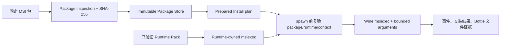

# Phase 2.3 跨宿主能力验证设计

## 状态

- 日期：2026-08-18
- 状态：M1 最小纵向切片已实现；M0 需从新输出根重新验证
- 前置里程碑：Phase 2.2 五应用、60 轮 fresh-Bottle 生命周期 soak
- 首批宿主：macOS ARM64、Linux x86_64
- 测试套件候选版本：`cross-host-capability-v3`

## 决策摘要

下一轮采用“能力 probe 先于大应用矩阵”的顺序：

1. 保持现有三个默认基线和五个认证扩展应用不变；
2. 新增独立的 MSI 可信安装请求，不把 MSI 伪装成 PE 可执行文件；
3. 建立 Win32、.NET/WPF、D3D9、D3D11、D3D12 的固定摘要 probe；
4. 为 Linux x86_64 增加显式 Runtime Pack Provider 和 X11/Wayland 观察适配；
5. probe 通过或明确判定 unsupported 后，再运行 Office、Java/SWT、Electron 三类真实应用 canary；
6. 每个应用的自动生命周期证据与人工功能签署保持两个门禁。

本阶段不以“启动过”作为成功，也不要求未声明的图形能力强行通过。例如 macOS Runtime
没有声明 D3D12 Provider 时，D3D12 probe 应为 `unsupported`；如果 Provider 声明 D3D11
可用但固定 probe 失败，则属于阻塞发布的 capability mismatch。

## 背景与当前边界

Phase 2.2 已能处理 inspection-bound PE 安装器和受限 portable ZIP，并为每个应用记录窗口、
截图、退出、Bottle 清理和残留进程。当前 Trusted Launch 仍以一个 PE executable 为信任入口：

- `launch-request.schema.json` 要求 `executable`；
- `guest-artifact.schema.json` 只接受 i386/x86_64 PE executable；
- MSI 是数据包，不能直接进入 PE inspection 或作为可执行入口；
- 当前仓库只有 macOS Runtime Provider，没有 Linux Wine Runtime Provider；
- macOS 的 System Events 观察方式不能移植到 Linux，Wayland 也不允许任意客户端全局枚举窗口；
- Compatibility Result 能表达 host、Runtime Pack 和检查结果，但不应承担 probe 专用观测的全部语义。

因此下一轮必须先补信任链和证据模型，再增加应用数量。

## 目标

Phase 2.3 完成时应具备：

- 同一套 probe 定义可在 macOS ARM64 和 Linux x86_64 Runner 上执行；
- Runtime Pack 声明的 Guest 架构、图形后端和桌面会话能力均有实际 probe 证据；
- MSI 由固定包摘要、受信任 `msiexec` handler、Prepared Install 和 spawn 前复验绑定；
- .NET/WPF probe 能区分 runtime 缺失、安装失败、窗口失败和渲染失败；
- D3D probe 能区分 unsupported、backend 初始化、shader/render、截图观察和 host-driver 失败；
- X11 可获得窗口和截图证据；Wayland 无 portal/测试协议时保持 `test-infrastructure`；
- 三类真实应用在两个宿主上各有一次人工 accepted 和十轮生命周期结果，或有闭合集 unsupported 结论；
- 所有结果绑定 package/probe、Recipe、Runtime Pack、Host、GPU/driver 和测试套件版本。

## 非目标

本阶段不包括：

- Linux ARM64、Android 或 ARM64 Windows Guest；
- Steam、反作弊、内核驱动、USB/串口设备和企业身份组件；
- D3DMetal、DXVK 或 vkd3d-proton 的下载与再分发；
- 将用户提供的商业组件写入仓库或默认 Runtime Pack；
- macOS/Linux 全硬件 Tier 1 认证；
- 30–50 应用大矩阵、性能排行榜或兼容评级自动发布；
- 把锁屏、Wayland portal 缺失或实验室离线记为产品回归。

## 验证矩阵

### 宿主与会话

| 维度 | 首轮必测 | 后续扩展 |
|---|---|---|
| macOS | ARM64、当前固定 x86_64 Wine Runtime、WineD3D | 第二代 Apple Silicon、下一 macOS 主版本、可选外部 D3D Provider |
| Linux | x86_64、一个固定 Wine Runtime、X11 | Wayland、AMD/Intel/NVIDIA、DXVK/vkd3d-proton |
| Guest | i386 Win32、x86_64 Win32/.NET/D3D | ARM64 Guest、旧 Windows 版本行为 |

Linux 首轮只建立 Preview 证据，不因此提升为 Tier 1。Wayland 首轮必须运行生命周期测试，
但只有测试 compositor、portal 或应用自报告能提供可复验证据时，窗口/截图项才可 passed。

### Probe 闭集

| Probe | Guest | 必须证明 | 允许结果 |
|---|---|---|---|
| `win32-window-text` | i386、x86_64 | 创建窗口、CJK 文本、文件写读、正常退出 | passed/failed |
| `dotnet-wpf-window` | x86_64 | CLR 启动、WPF 窗口、字体、按钮事件、退出 | passed/unsupported/failed |
| `d3d9-triangle` | i386、x86_64 | device 创建、帧呈现、非空截图、退出 | passed/unsupported/failed |
| `d3d11-triangle` | x86_64 | feature level、shader、present、截图、退出 | passed/unsupported/failed |
| `d3d12-triangle` | x86_64 | device/queue/swapchain、present、截图、退出 | passed/unsupported/failed |
| `msi-install-smoke` | x86_64 | Prepared Install、固定文件落盘、卸载/清理 | passed/unsupported/failed |

probe 源码可进入仓库；生成的 Windows 二进制不进入 Git。实验室构建必须固定编译器、源码摘要、
构建参数和输出 SHA-256，或使用可审计的官方发布资产。单纯 DLL/命令存在不能生成 available。

### 真实应用 canary

首轮只选择三个类别，每类一个固定版本：

| 类别 | 首选候选 | 主要验证点 |
|---|---|---|
| Office/生产力 | LibreOffice | MSI、复杂字体、文件打开/保存、多个子窗口 |
| Java/SWT | DBeaver Community portable | bundled JRE、SWT、文件选择、CJK、退出 |
| Electron | VS Code ZIP/portable 类 | Chromium 渲染、多进程、编辑保存、退出清理 |

实施前必须逐项确认官方来源、许可、固定 URL/摘要、自动化参数和合法测试范围。候选不满足这些条件时，
以同类别可公开测试的应用替换，不降低证据要求。商业 WPS、工业软件和硬件相关应用不进入首轮。

## MSI 可信安装设计

新增独立 `install-request.schema.json`，不修改 Schema v1 LaunchRequest 的既有语义。请求至少包含：

```text
schemaVersion
requestId
bottleId
package: path + sha256 + mediaType
handler: msiexec + closed arguments
constraints
```

处理链为：



约束如下：

- MSI 只作为 immutable input，不经过 PE inspection；
- handler 只接受闭集 `msiexec`，不能传任意 Guest command；
- 参数拒绝 shell、response file、网络 URL、外部 transform 和绝对宿主路径；
- Runtime Pack 必须绑定负责执行 `msiexec` 的 Wine/wineserver；
- Prepared Install 在 spawn 前复验包、Runtime、Context、Bottle lease 和完整计划；
- 安装结果必须检查预期文件，不能只看 `msiexec` 退出码；
- 卸载/失败清理只作用于目标 Bottle；
- Compatibility Result 的兼容字段 `installerDigest` 继续保存实际 package digest。

Portable ZIP 暂时保留现有受限 materializer；后续可与 MSI 共享 Package Store，但本阶段不为了抽象统一
而放宽 ZIP 的遍历、符号链接、重复项、覆盖或解压体积限制。

## Linux Provider 与桌面观察

新增 `compatforge-provider-linux`，遵循现有 Provider 证据边界：

- 只接受显式 Runtime Pack，不扫描 `PATH`、Home 目录或发行版 Wine；
- 复验 manifest、对象、物化 `wine`/`wineserver`、ELF 架构和实际版本命令；
- 把 WineD3D/DXVK/vkd3d-proton 能力绑定到同一 Runtime Pack digest；
- 记录 X11/Wayland、GPU、driver 和 audio session 观察；
- 文件存在或环境变量命中不能发布 available；
- 进程退出和 Bottle-scoped cleanup 复用 Process Supervisor 契约。

桌面观察分成：

- macOS：现有 launch PGID + 全局可见进程 fallback；
- Linux X11：固定测试代理读取 EWMH 窗口并由受控截图工具保存证据；
- Linux Wayland：优先测试 compositor 协议或 portal；不可用时窗口/截图为 `test-infrastructure`，
  不回退到不受信任的屏幕抓取或仅凭进程存活判定。

观察代理属于测试基础设施，版本和摘要进入 run metadata，不进入 Runtime capability 声明。

## 结果与人工签署

### Capability Probe Result

新增独立 `capability-probe-result.schema.json`，至少绑定：

- `probeId`、probe source/build/output digest；
- Host OS/version/architecture、GPU/driver、display protocol；
- Runtime Pack digest、translator 和 graphics backend；
- Guest architecture、开始/结束时间、outcome 和 failure classification；
- device/feature-level/backend observations；
- stdout、事件、截图及清理 artifact 的相对名称和摘要。

Compatibility Result 继续用于真实应用；不要把 probe 的 device/feature-level 细节塞入自由文本并假装
Recipe 已通过。

### Interaction attestation v3

Phase 2.3 不直接复用可预填的 schemaVersion 2 工作表。Runner 先生成绑定本次 run 的工作表，再由人签署：

- run ID、Recipe/package/Runtime Pack digest；
- Host、GPU/driver、display protocol；
- 目标窗口标题和 screenshot digest；
- 每个交互检查默认 false；
- observer 和带时区 observedAt；
- 对最终 JSON 的 evidence digest。

签署只能提升同一 run，不能跨版本、宿主、Runtime 或截图复用。没有签署时自动生命周期可 verified，
应用兼容结果仍为 `policy-blocked`。

## 执行阶段

### M0：冻结 Phase 2.2

- 旧 60 轮运行在第 23 轮后停止，包含 hard failure，不得作为通过证据；
- 修复桌面预检、fail-fast 和 Bottle-scoped recovery 后，从新输出根重新运行；
- hard failure 必须为 0；
- 所有 infrastructure-unverified 轮次在可观察桌面重新补跑；
- 保存 cycles、summary、截图和 Runtime/Recipe 摘要；
- 人工签署单独完成，不改写原始自动证据。

### M1：契约与信任链

- capability probe/result schema；
- Prepared Install + MSI immutable input；
- Linux Runtime Provider；
- interaction attestation v3；
- 负向合同覆盖摘要漂移、符号链接、路径穿越、非法参数、Runtime 漂移和跨 run 签署。

### M2：Probe canary

- macOS ARM64 运行全部适用 probe；
- Linux x86_64 X11 运行同一 probe 集；
- declared capability 与 probe 结果不一致时立即停止应用扩展；
- Wayland 只在观察基础设施可复验后加入视觉门禁。

### M3：应用 canary

- 三个类别、每宿主每应用先运行一个 fresh Bottle；
- 自动证据通过后执行一次 v3 人工签署；
- 每宿主每应用再运行 10 轮 fresh-Bottle 生命周期测试；
- 任一 hard failure 先修复并从空 Bottle 重跑，不用后续成功覆盖失败记录。

### M4：扩大决策

只有 M0–M3 达标后，才决定进入 20 个应用矩阵或 Linux 多 GPU/Wayland 实验室。Phase 2.3 的结果
只覆盖实际 Host × Runtime × Backend × App 组合，不直接授予 macOS/Linux Tier 1。

## 发布与退出门禁

Phase 2.3 里程碑完成必须同时满足：

1. Phase 2.2 的 60 轮完成、零 hard failure；
2. MSI 不绕过 Package/Prepared Install 信任链；
3. 所有 Provider 已声明能力都有匹配 probe；
4. macOS 和 Linux X11 各自的适用 probe 没有 capability mismatch；
5. 三类应用在每个适用宿主上至少一次人工 accepted；
6. 已 accepted 的宿主/应用组合随后完成 10/10 生命周期轮次且零残留；
7. unsupported、policy-blocked、test-infrastructure 与产品失败分别统计；
8. 仓库 contract、schema、Rust workspace、Clippy 和平台 Runner 门禁通过；
9. 所有下载、Runtime、二进制、截图和日志仍位于仓库外；
10. 报告明确列出未覆盖的 GPU、Wayland、D3D backend 和应用版本。

任一项未满足时，允许保留 Preview/blocked 证据，但不得发布为跨平台兼容通过。

## 立即实施顺序

下一实现批次只做 M1 的最小纵向切片：

1. capability probe manifest/result schema 和独立 validator；
2. 一个 x86_64 Win32 probe 的 macOS 现有 Runner 适配；
3. MSI Prepared Install 合同与完全离线的负向 fixture；
4. 不执行真实 MSI、不引入 Linux Provider、不下载应用；
5. 合同评审通过后再进入真实 probe 和 Linux 实验室。

这样可以先冻结可信边界，避免在 MSI、Linux 和 D3D 三条新路径上同时形成不可复验的临时实现。
